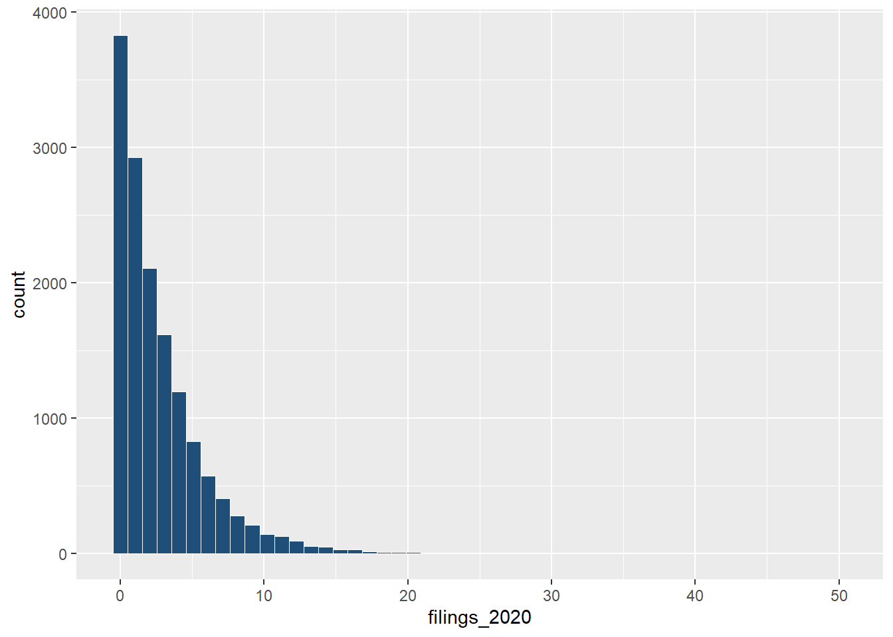

## The Policy Problem

-   Eviction filings are not evenly distributed across Philadelphia.

-   Limited rental assistance resources require a way to identify where preventive intervention may be most needed.\
    \
    \*\*This project asks whether eviction filing data can help identify high-risk census tracts before housing instability worsens.\*\*

## Research Question

Can recent eviction filing patterns help predict future eviction risk across Philadelphia census tracts?\
\
We focus on three questions:\
\
- Which tracts show persistent high filing activity?\
- Does monthly or quarterly prediction work better?\
- Can the model support rental assistance targeting?

## Data and Study Design

| Component  | Description                           |
|------------|---------------------------------------|
| Outcome    | Eviction filings                      |
| Geography  | Philadelphia tracts                   |
| Period     | Mar 2023–Mar 2026                     |
| Predictors | Filing history, ACS housing variables |
| Task       | Predict next month / quarter          |
| Use        | Target rental assistance              |

## Why Focus on March 2023–March 2026?

**The model needs a stable policy environment.**

::: incremental
-   Pandemic-era filing patterns were highly disrupted.
-   March 2023 onward shows more consistent monthly variation.
-   This period better reflects current eviction risk.
-   We use this period to train a more comparable forecasting model.
:::

## Eviction Filings Are Highly Skewed

{width="95%"}

## What This Distribution Means

-   Most tract-months have zero or very low filings.
-   A small number of observations have much higher filing counts.
-   This distribution supports using count-based models and high-risk classification.

## Spatial Patterns of Eviction Risk

{fig-align="center"}

## What the Spatial Pattern Shows

-   Eviction burden is not evenly distributed across Philadelphia.
-   Raw filing counts show where total eviction activity is highest.
-   Renter-adjusted rates show where eviction risk is most concentrated.
-   Tracts high on both measures are stronger candidates for rental assistance targeting.

## Eviction Risk and Neighborhood Demographics

| Tract racial majority | Avg. monthly filings |
|-----------------------|---------------------:|
| Black                 |                 3.80 |
| Hispanic              |                 2.63 |
| Other                 |                 2.60 |
| White                 |                 1.70 |

## Structural Housing Inequality

-   Black-majority tracts show higher average eviction filing levels.
-   Hispanic-majority and other-majority tracts also show higher filings than white-majority tracts.
-   These patterns suggest eviction risk reflects broader structural disparities in housing stability.
-   Model outputs should be interpreted with equity safeguards.

## Modeling Strategy

We test whether recent filing history can predict future tract-level eviction risk.

-   **Monthly model:** predicts next-month eviction filings.
-   **Quarterly model:** predicts next-quarter eviction filings.
-   **Key predictors:** lagged filings, rolling averages, historical baselines, and ACS housing variables.
-   **Evaluation:** prediction error, tract ranking, and high-risk classification.

## Monthly vs. Quarterly Forecasting

We compare two forecasting scales because they serve different policy needs.

::::: columns
::: {.column width="50%"}
### Monthly

-   Shorter intervention window
-   More sensitive to recent changes
-   Better for rapid outreach
-   More month-to-month noise
:::

::: {.column width="50%"}
### Quarterly

-   Smoother filing patterns
-   Better for broader planning
-   Less reactive to sudden spikes
-   Longer delay before intervention
:::
:::::

## From Data to Policy Targeting

::: incremental
1.  Use recent eviction filing history.
2.  Add tract-level housing conditions.
3.  Predict future filing risk.
4.  Identify elevated-risk census tracts.
5.  Support rental assistance targeting.
:::

## Model Performance Summary

| Model            | Scale     | Test MAE | Test RMSE | Corr. |
|------------------|-----------|---------:|----------:|------:|
| Rolling baseline | Monthly   |    1.657 |     2.441 | 0.678 |
| Baseline         | Quarterly |    3.718 |     5.422 | 0.779 |

------------------------------------------------------------------------

## Model Performance Summary

-   Recent filing history is highly predictive.
-   Simple temporal baselines perform better than more complex models.
-   Adding more structural covariates does not always improve out-of-sample accuracy.
-   Monthly prediction is more useful for short-term intervention planning.

## Why Monthly Forecasting Is More Useful for Targeting

-   Rental assistance is often time-sensitive.
-   Monthly forecasts identify risk closer to when filings may occur.
-   Recent filing history and rolling averages capture short-term persistence.
-   This makes monthly prediction better suited for early outreach and prevention.

## Monthly Model Diagnostics

{fig-align="center"}

## The Model Captures Patterns but Misses Extremes

-   Predictions follow the general tract-level pattern.
-   The model compresses the upper tail of high-filing tracts.
-   Extreme filing spikes remain difficult to predict.
-   This supports using the model as a screening tool, not an automatic decision rule.

## Quarterly Model Diagnostics

{fig-align="center"}

## Quarterly Model Trade off

Quarterly aggregation smooths short-term noise, but it can hide sudden tract-level changes.

-   Quarterly predictions are less sensitive to monthly volatility.
-   This can help with general planning.
-   But the model struggles with extreme high-filing tracts.
-   For targeted rental assistance, this delay can be costly.

## Policy Application

The model is most useful as an early-warning and prioritization tool.

-   Identify tracts with elevated predicted filing risk.
-   Prioritize outreach before filings escalate.
-   Support rental assistance targeting at the neighborhood level.
-   Combine model output with local knowledge and equity review.

**The model should support policy judgment, not replace it.**

## Key Takeaways

1.  Eviction filings in Philadelphia are spatially concentrated and structurally uneven.
2.  Recent filing history is the strongest short-term predictor of future filings.
3.  Forecasting models can help target rental assistance, but should be used with equity checks and policy judgment.

## Conclusion

**Eviction risk is predictable enough to support early intervention, but not predictable enough to automate policy decisions.**

A short-term forecasting model can help Philadelphia identify elevated-risk tracts and prioritize rental assistance outreach.

Its strongest use is not replacing human judgment, but making policy response faster, more targeted, and more transparent.

## Thank You！ {.center}

  

**Questions and Discussion ？**

  

Daisy, Gab, Johnny, Yiting

*CPLN 5920 \| Philadelphia Eviction Forecasting Model*
